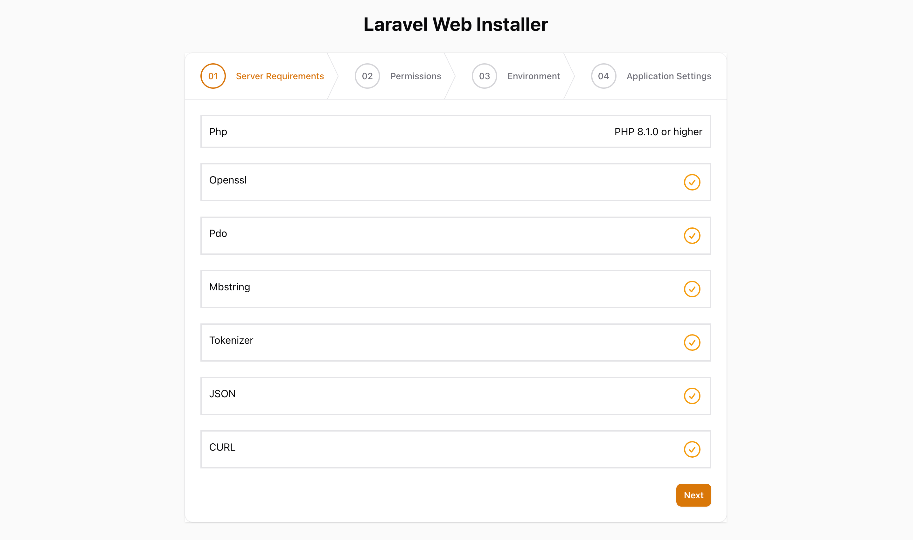
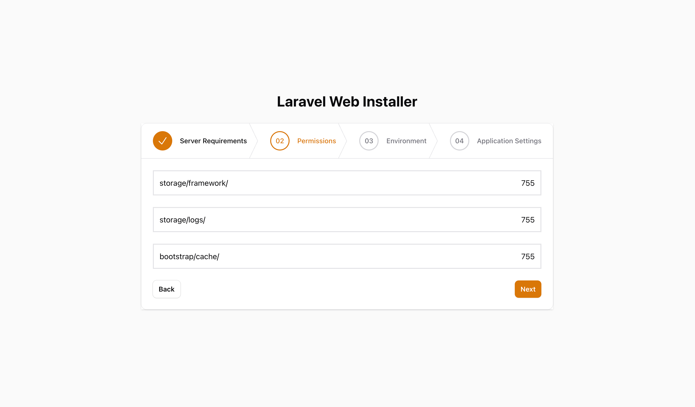
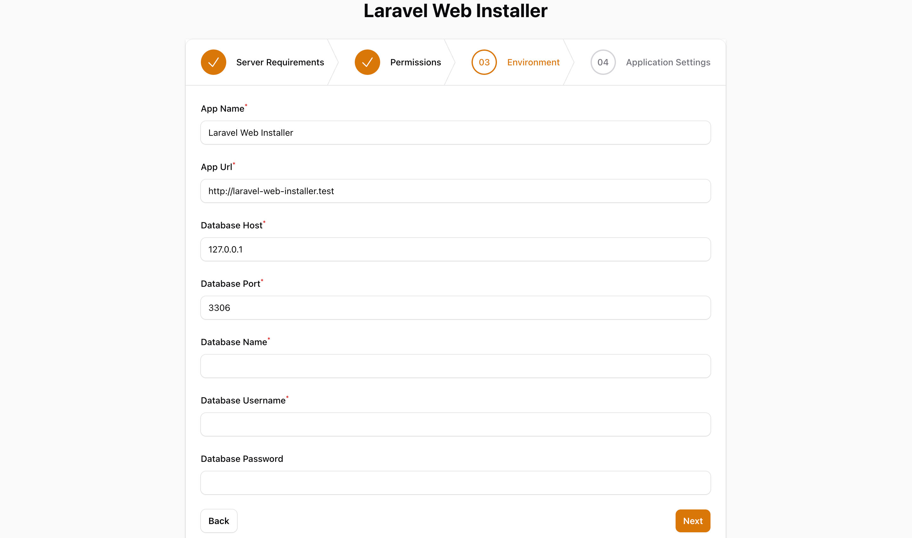
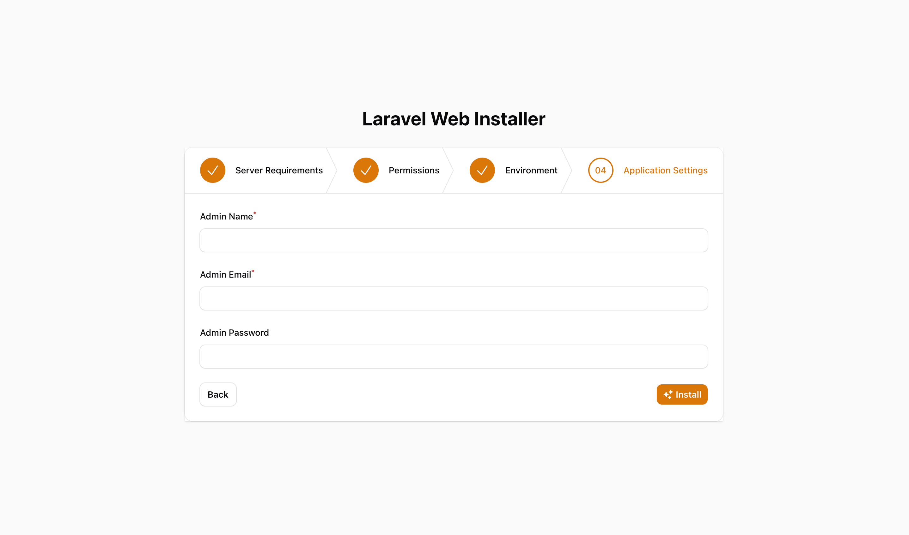

# Laravel Web Installer

## Installation 
```ssh
composer require shipu/web-installer
```
then publish the assets
```ssh
php artisan vendor:publish --tag=web-installer-assets
 ```

## Screenshots






Protect other routes if not installed.

First register it in `app\Http\Kernel.php`:

```php
protected $routeMiddleware = [
    // ...
    'redirect.if.not.installed' => \Shipu\WebInstaller\Middleware\RedirectIfNotInstalled::class,
];
```
Now you can apply the middleware to a route or route-group. Eg:

```php
Route::group(['middleware' => 'redirect.if.not.installed'], function () {
    Route::get('/', function () {
        return view('welcome');
    });
});
```

In Filament, if you want to protect all admin panel routes then you have to add middleware in panel service provider. Eg:

```php
public function panel(Panel $panel): Panel
{
    return $panel
        ...
        ->middleware([
            \Shipu\WebInstaller\Middleware\RedirectIfNotInstalled::class,
            ...
        ]);
}
```